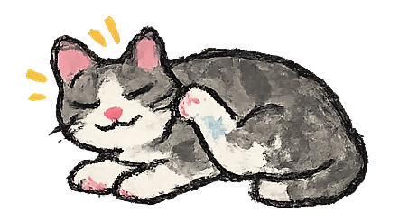
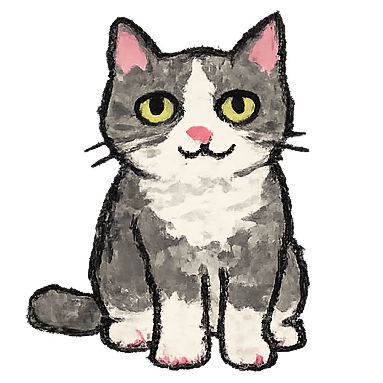
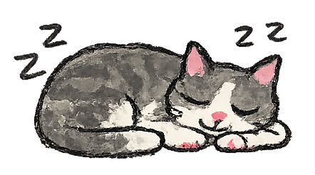

# 🐱 Desktop Cat - Gatito de Escritorio

[](https://dotnet.microsoft.com/)
[](https://avaloniaui.net/)
[](LICENSE)
[](https://github.com/laurareyeslarrosa/desktop-cat)

Un gatito adorable que vive en tu escritorio. Creado con Avalonia UI y .NET 8.

<div align="center">
  <table>
    <tr style="border-top: none;">
      <td align="center" style="border: none;"></td>
      <td align="center" style="border: none;"></td>
      <td align="center" style="border: none;"></td>
    </tr>
  </table>
</div>

## ✨ Características

- 🐱 Gatito flotante en el escritorio
- 🖱️ Arrastrable con el mouse
- 📌 Icono en la bandeja del sistema
- 🔔 Notificaciones interactivas
- 🎯 Siempre visible (TopMost)
- 💻 Multiplataforma (Windows, Linux, macOS)

## 📥 Descargas

| Plataforma | Descarga | Tamaño |
|------------|----------|--------|
| 🪟 Windows Zip | [Descargar](https://github.com/laurareyeslarrosa/desktop-cat/releases/download/desktop-cat/DesktopCat-Windows.zip) | ~40 MB |
| 🐧 Linux Zip | [Descargar](https://github.com/laurareyeslarrosa/desktop-cat/releases/download/desktop-cat/DesktopCat-Linux.zip) | ~40 MB |
| 🐧 Linux RPM | [Descargar](https://github.com/laurareyeslarrosa/desktop-cat/releases/download/desktop-cat//DesktopCat-1.0.0-1.x86_64.rpm) | ~40 MB |
| 🍎 macOS Zip | [Descargar](https://github.com/laurareyeslarrosa/desktop-cat/releases/download/desktop-cat//DesktopCat-macOS.zip) | ~40 MB |

## 🚀 Instalación

### Windows
1. Descarga `DesktopCat-Windows.zip`
2. Extrae el contenido
3. Ejecuta `DesktopCat.exe`

### Linux - Zip
1. Descarga `DesktopCat-Linux.zip`
2. Extrae el contenido
3. Da permisos de ejecución: `chmod +x DesktopCat`
4. Ejecuta: `./DesktopCat`

### Linux - RPM (openSUSE - para otras distros consultar su manejador de paquetes)
1. descargar el rpm y ejecutar
2. zypper in ./DesktopCat-1.0.0-1.x86_64.rpm

### macOS
1. Descarga `DesktopCat-macOS.zip`
2. Extrae el contenido
3. Ejecuta `DesktopCat`

## 🛠️ Desarrollo

### Requisitos
- .NET 8 SDK
- Visual Studio Code (recomendado) o Visual Studio

### Clonar y ejecutar
```bash
git clone https://github.com/tu-usuario/desktop-cat.git
cd desktop-cat
dotnet restore
dotnet run