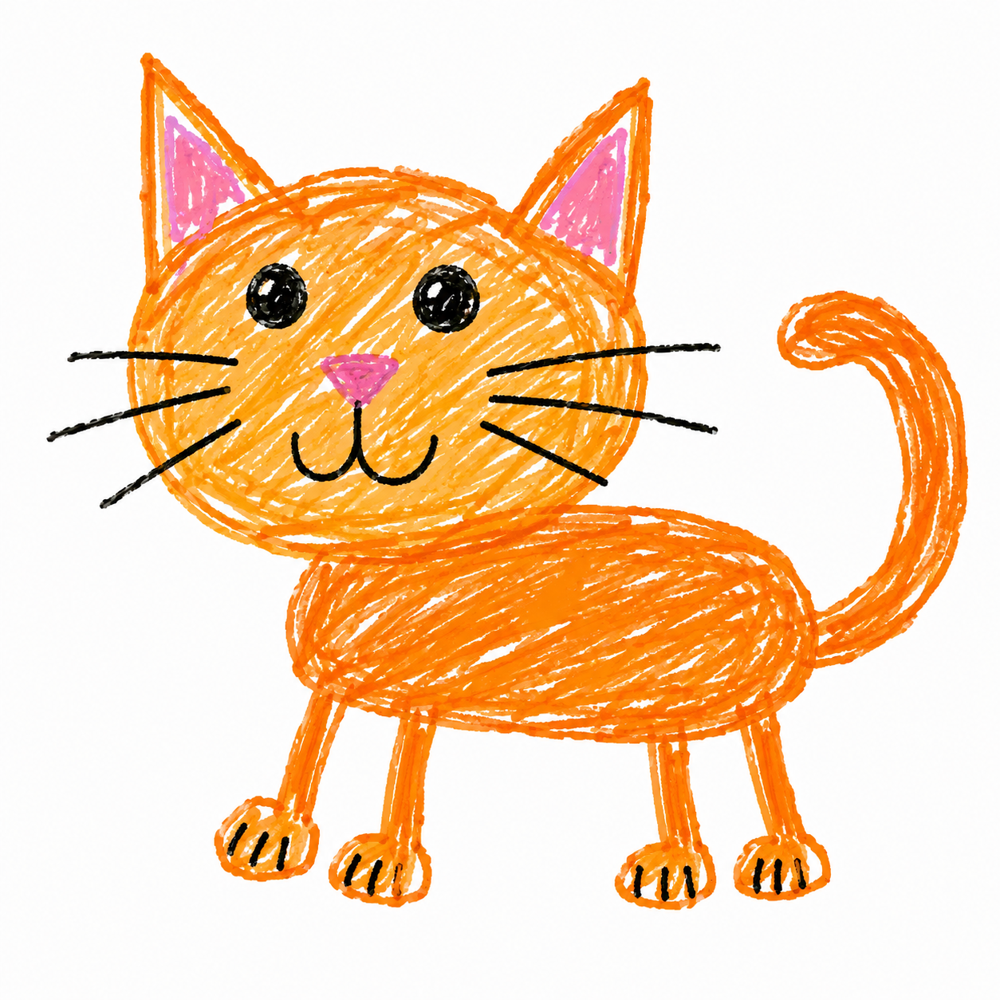

# 🐱 Desktop Cat - Gatito de Escritorio

Un gatito adorable que vive en tu escritorio. Creado con Avalonia UI y .NET 8.



## ✨ Características

- 🐱 Gatito flotante en el escritorio
- 🖱️ Arrastrable con el mouse
- 📌 Icono en la bandeja del sistema
- 🔔 Notificaciones interactivas
- 🎯 Siempre visible (TopMost)
- 💻 Multiplataforma (Windows, Linux, macOS)

## 📥 Descargas

| Plataforma | Descarga | Tamaño |
|------------|----------|--------|
| 🪟 Windows | [Descargar](Releases/DesktopCat-Windows.zip) | ~40 MB |
| 🐧 Linux | [Descargar](Releases/DesktopCat-Linux.zip) | ~40 MB |
| 🍎 macOS | [Descargar](Releases/DesktopCat-macOS.zip) | ~40 MB |

## 🚀 Instalación

### Windows
1. Descarga `DesktopCat-Windows.zip`
2. Extrae el contenido
3. Ejecuta `DesktopCat.exe`

### Linux
1. Descarga `DesktopCat-Linux.zip`
2. Extrae el contenido
3. Da permisos de ejecución: `chmod +x DesktopCat`
4. Ejecuta: `./DesktopCat`

### macOS
1. Descarga `DesktopCat-macOS.zip`
2. Extrae el contenido
3. Ejecuta `DesktopCat`

## 🛠️ Desarrollo

### Requisitos
- .NET 8 SDK
- Visual Studio Code (recomendado) o Visual Studio

### Clonar y ejecutar
```bash
git clone https://github.com/tu-usuario/desktop-cat.git
cd desktop-cat
dotnet restore
dotnet run